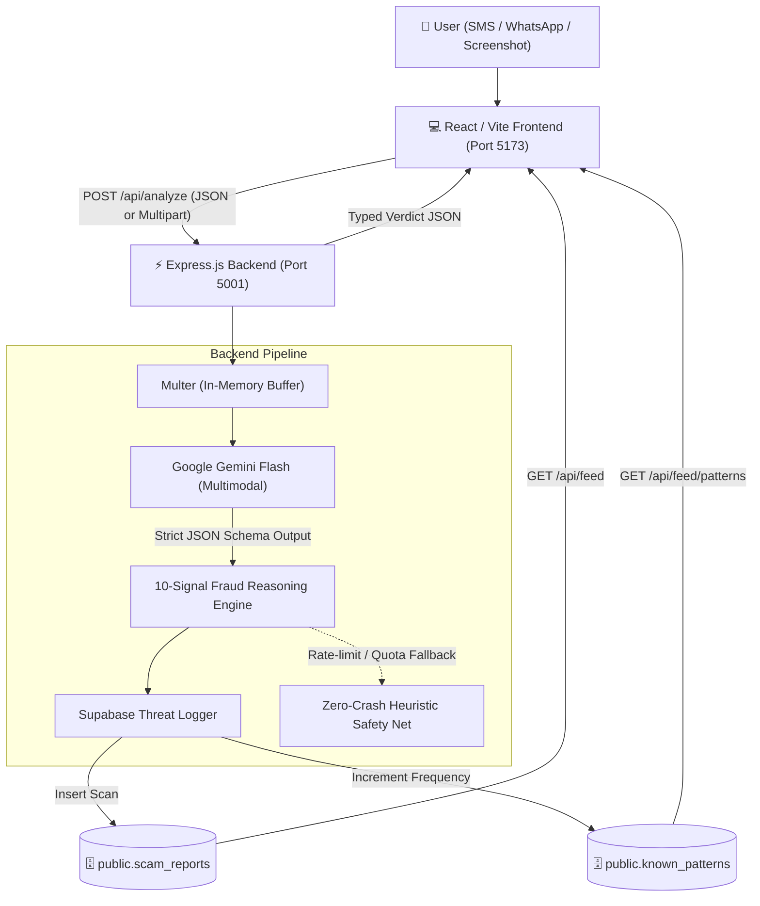

# 🛡️ ScamShield — AI Scam & Fraud Message Detector

> **Hackathon**: BUILD WITH भारत 2.0 (National Level Hackathon)  
> **Team Name**: ScamStop  
> **Team Members**: Aashnee Sethi, Anshul Garg, Divishi Chaudhary  
> **Institution**: Indira Gandhi Delhi Technical University for Women (IGDTUW)  
> **Domain**: Innovative Solution for Cybersecurity (FinTech-Adjacent, Social Impact, AI/ML)

---

## 📖 1. Overview & Problem Statement

Digital payment fraud in India has surged **41x in five years**, nearing **₹23,000 crore** (RBI Annual Report 2025–26), with over **28 lakh cyber fraud cases** reported on the National Cyber Crime Reporting Portal in 2025 alone.

Victims are disproportionately **first-time internet/UPI users, elderly citizens, and residents of Tier-2/3 cities** in Bharat who are least served by English-only, technical security tools.

### The Gap in Existing Tools:
- **Truecaller / Carrier Spam Filters**: Silently block or flag known phone numbers using reactive blocklists. They **do not explain why** a message is dangerous, and they cannot catch new scams from fresh virtual numbers.
- **CyberDost**: Provides static cybersecurity advisories, not instant, real-time AI analysis.

### The ScamShield Solution:
**"Paste it. Scan it. Understand it. Stay protected."**
ScamShield is an instant, multimodal AI fraud detector tailored for India. Users paste an SMS, WhatsApp message, email, or upload a screenshot. In under 2 seconds, ScamShield evaluates **10 behavioral fraud signals**, explains the danger in **plain Hindi and English**, offers actionable safety advice (e.g. calling **1930**), and logs the pattern to a **shared Supabase community intelligence network** so individual defense strengthens collective protection.

---

## 🏛️ 2. Full-Stack Architecture



---

## 🔍 3. The 10 Fraud Signals Evaluated

ScamShield evaluates the underlying psychological intent and mechanics of fraud rather than relying on phone number blocklists:

| # | Signal | Description & Indian Cybercrime Example |
|---|---|---|
| 1 | **Urgency** | *"Act within 10 minutes"*, *"Electricity cut tonight at 9:30 PM"* |
| 2 | **Authority Impersonation** | Posing as *"RBI Notice"*, *"SBI / HDFC"*, *"Income Tax Dept"*, *"Police"* |
| 3 | **Financial Request** | *"Pay ₹500 processing fee"*, *"Deposit money to claim loan"* |
| 4 | **OTP Request** | *"Send OTP to verify"*, *"Share 6-digit code received"* |
| 5 | **Suspicious URL** | Non-bank domains (*.xyz, .top, .app, bit.ly, fake banking links*) |
| 6 | **Reward Bait** | *"You have won ₹10 Lakhs in KBC"*, *"Earn ₹5000/day liking YouTube videos"* |
| 7 | **Threat** | *"Account will be blocked"*, *"Arrest warrant issued"*, *"SIM deactivated"* |
| 8 | **Emotional Manipulation** | *"Emergency, hospital payment needed"*, *"Friend in urgent distress"* |
| 9 | **Credential Request** | Asking for netbanking password, UPI PIN, ATM card CVV/expiry |
| 10 | **Sender Mismatch** | Claimed bank notice sent from personal mobile (`+91 98xxx`) instead of approved DLT header (`VM-SBIINB`) |

---

## 📁 4. Project Directory Layout

```
ScamShield/
├── frontend/                  # 💻 React / Vite Frontend Application (Aashnee)
│   ├── index.html
│   ├── package.json
│   ├── vite.config.js
│   └── src/
│       ├── App.jsx            # Main Scanner UI & Result Card
│       ├── App.css            # Dark cybersecurity theme & styling
│       └── main.jsx
│
├── src/                       # ⚡ Node.js / Express Backend (Anshul)
│   ├── index.js               # Express server entrypoint & CORS config
│   ├── config/
│   │   ├── env.js             # Environment variable validator
│   │   └── supabase.js        # Supabase client & in-memory fallback
│   ├── constants/
│   │   ├── schemas.js         # Gemini Flash strict JSON Schema
│   │   └── prompts.js         # Few-shot prompts for Indian fraud
│   ├── services/
│   │   ├── gemini.service.js   # Multimodal Gemini Flash AI service
│   │   ├── fallback.service.js # Zero-crash heuristic safety net (Demo defense)
│   │   └── feed.service.js     # Supabase query handler & stats aggregator
│   ├── middleware/
│   │   ├── upload.middleware.js # Multer screenshot memory storage (5MB max)
│   │   └── error.middleware.js  # Global error & 404 handler
│   ├── controllers/
│   │   ├── analyze.controller.js # POST /api/analyze controller
│   │   └── feed.controller.js    # GET /api/feed, /patterns & /stats
│   └── routes/
│       ├── analyze.routes.js   # /api/analyze
│       ├── feed.routes.js      # /api/feed
│       └── health.routes.js    # /api/health
│
├── supabase/                  # 🗄️ Supabase PostgreSQL Database (Divishi)
│   └── schema.sql             # SQL table schema, RLS policies, & seed data
├── test/                      # 🧪 Automated Test Suites
│   ├── test-api.js            # End-to-end integration test runner (8/8 passing)
│   ├── test-real-scams.js     # Live test suite with 5 real Indian fraud cases
│   └── test-payloads.json     # Sample payloads (SBI KYC, Electricity, Safe SMS)
├── .env.example               # Template for environment configuration
├── package.json               # Backend dependencies and test scripts
└── Readme.md                  # Complete project documentation
```

---

## 🚀 5. Getting Started (Step-by-Step)

### Step 1: Clone the Repository
```bash
git clone https://github.com/anshulgarg1133/ScamShield.git
cd ScamShield
```

---

### Step 2: Configure Backend Environment Variables
Create your `.env` file at the root:
```bash
cp .env.example .env
```
Open `.env` and fill in your keys:
```env
PORT=5001
NODE_ENV=development
FRONTEND_URL=http://localhost:3000,http://localhost:5173

# Google Gemini API Key (from https://aistudio.google.com/app/apikey)
GEMINI_API_KEY=your_gemini_api_key_here

# Supabase Credentials (from Supabase Dashboard -> Project Settings -> API)
SUPABASE_URL=https://your-project.supabase.co
SUPABASE_ANON_KEY=your_supabase_anon_key_here
```
*(Note: If keys are omitted, the backend automatically runs in **Zero-Crash Fallback Mode** with mock data so the app never crashes!)*

---

### Step 3: Run the Backend Server
Open **Terminal 1** at the project root:
```bash
# Install backend dependencies
npm install

# Start backend in watch mode
npm run dev
```
Your backend will start on: **`http://localhost:5001`**  
Check health: `curl http://localhost:5001/api/health`

---

### Step 4: Run the Frontend
Open **Terminal 2**:
```bash
cd frontend

# Install frontend dependencies
npm install

# Start Vite React dev server
npm run dev
```
Your frontend will start on: **`http://localhost:5173`**  
Open it in your browser, paste a suspicious message or upload a screenshot, and click **Analyze message**!

---

## 🗄️ 6. Supabase Setup & RLS Policy (For Divishi)

If you are setting up or fixing the database tables in Supabase, run this in the **Supabase SQL Editor**:

```sql
CREATE EXTENSION IF NOT EXISTS "uuid-ossp";

-- 1. scam_reports table
CREATE TABLE IF NOT EXISTS public.scam_reports (
    id UUID PRIMARY KEY DEFAULT gen_random_uuid(),
    message_text TEXT NOT NULL,
    scam_type TEXT NOT NULL DEFAULT 'None',
    risk_level TEXT NOT NULL DEFAULT 'Low', -- 'Low', 'Medium', 'High'
    scam_probability NUMERIC(4, 2) NOT NULL DEFAULT 0.00, -- 0.00 to 1.00
    language TEXT NOT NULL DEFAULT 'English',
    source TEXT NOT NULL DEFAULT 'sms', -- 'sms', 'whatsapp', 'email', 'screenshot'
    verdict_reason TEXT,
    reported_at TIMESTAMPTZ NOT NULL DEFAULT now()
);

-- 2. known_patterns table (Grows smarter over time)
CREATE TABLE IF NOT EXISTS public.known_patterns (
    id UUID PRIMARY KEY DEFAULT gen_random_uuid(),
    pattern_text TEXT NOT NULL,
    scam_type TEXT NOT NULL,
    frequency_count INT4 NOT NULL DEFAULT 1,
    last_seen TIMESTAMPTZ NOT NULL DEFAULT now()
);

-- 3. Row Level Security (RLS) Policies
ALTER TABLE public.scam_reports ENABLE ROW LEVEL SECURITY;
ALTER TABLE public.known_patterns ENABLE ROW LEVEL SECURITY;

CREATE POLICY "Allow public insert on scam_reports" ON public.scam_reports FOR INSERT WITH CHECK (true);
CREATE POLICY "Allow public select on scam_reports" ON public.scam_reports FOR SELECT USING (true);

CREATE POLICY "Allow public all on known_patterns" ON public.known_patterns FOR ALL USING (true);
```

---

## 🔌 7. API Reference & Contract

### 1. `POST /api/analyze` — Analyze Message or Screenshot
- **Content-Type**: `application/json` (for text) OR `multipart/form-data` (for screenshots).
- **Accepted Fields**:
  - `text`: String (message body)
  - `image`: File (`png`, `jpg`, `jpeg`, `webp` up to 5MB)
  - `sender`: String (e.g. `+91 98123 45678`)
  - `language`: String (`"hi"` or `"en"`)
  - `source`: String (`"sms"`, `"whatsapp"`, `"email"`, `"screenshot"`)

#### Example Response (`200 OK`):
```json
{
  "success": true,
  "data": {
    "scam_probability": 98,
    "risk_level": "HIGH",
    "category": "BANK_KYC_PHISHING",
    "summary": {
      "en": "Fake SBI KYC update phishing scam aimed at stealing netbanking credentials.",
      "hi": "भारतीय स्टेट बैंक (SBI) के नाम पर फर्जी केवाईसी लिंक जो आपके बैंक खाते को चुराने के लिए बनाया गया है।"
    },
    "signals": [
      {
        "signal": "Urgency",
        "detected": true,
        "evidence": "will be blocked today",
        "explanation": "Forces immediate action to bypass critical thinking."
      },
      {
        "signal": "Authority impersonation",
        "detected": true,
        "evidence": "Dear SBI Customer",
        "explanation": "Posing as State Bank of India."
      },
      {
        "signal": "Suspicious URL",
        "detected": true,
        "evidence": "http://sbi-kyc-update.xyz",
        "explanation": "Uses an unverified .xyz domain instead of official onlinesbi.sbi."
      }
    ],
    "reasoning": "The message exhibits 6 high-risk fraud signals: authority impersonation (SBI), threat of account closure, artificial urgency, and an unverified suspicious .xyz URL.",
    "actionable_advice": {
      "en": [
        "DO NOT click the link.",
        "Banks never request KYC updates via SMS links.",
        "Report cyber fraud immediately at 1930 or cybercrime.gov.in."
      ],
      "hi": [
        "दिए गए लिंक पर बिल्कुल क्लिक न करें।",
        "बैंक कभी भी एसएमएस लिंक के जरिए केवाईसी अपडेट करने को नहीं कहते।",
        "धोखाधड़ी की शिकायत राष्ट्रीय साइबर हेल्पलाइन 1930 पर करें।"
      ]
    },
    "is_safe_to_interact": false,
    "extracted_text": "Dear Customer, your SBI account is blocked. Update KYC at http://sbi-kyc-update.xyz immediately.",
    "fallback_mode": false
  }
}
```

---

### 2. `GET /api/feed` — Recent Community Scams
Returns recent scam reports from Supabase `public.scam_reports`:
```bash
curl http://localhost:5001/api/feed?limit=5
```

### 3. `GET /api/feed/patterns` — Trending Fraud Signatures
Returns active scam campaigns from Supabase `public.known_patterns` sorted by frequency:
```bash
curl http://localhost:5001/api/feed/patterns
```

### 4. `GET /api/feed/stats` — Threat Intelligence Metrics
Returns aggregated metrics for the dashboard counters (total scans, scam rate %, category breakdown):
```bash
curl http://localhost:5001/api/feed/stats
```

---

## 🧪 8. Testing & Verification

### Run Automated Integration Tests (8/8 checks):
```bash
npm test
```
Tests health check, fake KYC scam, genuine bank debit alert, screenshot uploads, community feed, and stats.

### Run Live Real-World Fraud Scenarios (Gemini AI):
```bash
npm run test:real
```
Tests 5 live cases:
1. Fake SBI YONO KYC Phishing (`98% High Risk`)
2. Electricity Cutoff Scam at 9:30 PM (`98% High Risk`)
3. Telegram YouTube-Like Job Scam (`98% High Risk`)
4. KBC Lottery WhatsApp Scam from `+92` foreign code (`100% High Risk`)
5. Genuine HDFC Bank Swiggy Debit SMS (`0% Low Risk / Safe`)

---

## 🛡️ 9. Hackathon Zero-Crash Resilience ("Demo Insurance")

During live presentations, third-party APIs can experience rate limits (`429`) or temporary outages (`503`).

**How ScamShield guarantees your live demo NEVER crashes:**
1. **Heuristic Safety Net (`src/services/fallback.service.js`)**: If Gemini is unreachable, rate-limited, or throws an error, the backend intercepts the exception and runs a local regex pattern engine across all 10 signals, returning the **identical JSON schema** with `fallback_mode: true`. The user and frontend never receive a 500 error!
2. **In-Memory Store (`src/config/supabase.js`)**: If Supabase credentials are missing or RLS blocks writes, the server caches reports in memory so the trending feed continues uninterrupted.

---

## 👥 10. Team Roles & Contributions

- **Aashnee Sethi**: Frontend engineering, React UI, dark mode styling, and bilingual Hindi/English toggle.
- **Anshul Garg**: Backend engineering, Node.js/Express architecture, Gemini Flash multimodal pipeline, 10-signal reasoning engine, and Zero-Crash fallback.
- **Divishi Chaudhary**: Database architecture, Supabase PostgreSQL schema (`scam_reports` & `known_patterns`), RLS policies, and seed data.
