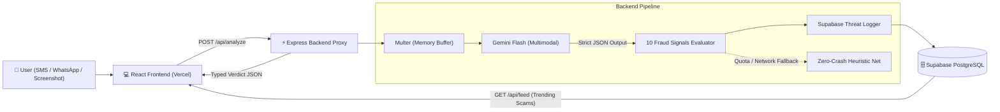

# 🛡️ ScamShield Backend — AI Scam/Fraud Message Detector

> **Hackathon**: BUILD WITH भारत 2.0 (National Level Hackathon)  
> **Team Name**: ScamStop  
> **Team Members**: Aashnee Sethi, Anshul Garg, Divishi Chaudhary  
> **Institution**: Indira Gandhi Delhi Technical University for Women (IGDTUW)  
> **Domain**: Innovative Solution for Cybersecurity (FinTech-Adjacent, Social Impact, AI/ML)

---

## 📖 Overview

**ScamShield** protects everyday Indian citizens—especially first-time UPI users, semi-literate, and elderly populations in Tier-2/3 India—from financial fraud. 

Users can paste a suspicious **SMS, WhatsApp, or Email message** or upload a **screenshot**. ScamShield evaluates **10 critical fraud signals** using **Google Gemini Flash**, provides plain-language explanations in **English and Hindi**, and logs reports to a **Supabase community pattern database** ("Trending Scams This Week") so individual protection strengthens collective defense.

---

## 🏛️ Architecture & Dataflow



---

## 🔍 The 10 Fraud Signals Evaluated

Gemini Flash and the backend engine strictly evaluate the message against 10 specific signals:

| # | Signal | Description & Indian Context Example |
|---|---|---|
| 1 | **Urgency** | *"Act within 10 minutes"*, *"Electricity cut tonight at 9:30 PM"* |
| 2 | **Authority Impersonation** | Posing as *"RBI Notice"*, *"SBI / HDFC"*, *"Income Tax Dept"*, *"Police"* |
| 3 | **Financial Request** | *"Pay ₹500 processing fee"*, *"Deposit money to claim loan"* |
| 4 | **OTP Request** | *"Send OTP to verify"*, *"Share 6-digit code received"* |
| 5 | **Suspicious URL** | Non-bank domains (*.xyz, .top, .app, bit.ly, fake netbanking URLs*) |
| 6 | **Reward Bait** | *"You have won ₹10 Lakhs in KBC"*, *"Earn ₹5000/day liking YouTube videos"* |
| 7 | **Threat** | *"Account will be blocked"*, *"Arrest warrant issued"*, *"SIM deactivated"* |
| 8 | **Emotional Manipulation** | *"Emergency, hospital payment needed"*, *"Friend in urgent distress"* |
| 9 | **Credential Request** | Asking for netbanking password, UPI PIN, ATM card CVV/expiry |
| 10 | **Sender Mismatch** | Claimed bank notice sent from personal mobile number (`+91 98xxx`) instead of approved DLT header (`VM-SBIINB`) |

---

## 📁 Repository Structure

```
ScamShield-1/
├── package.json               # ES Modules, scripts, dependencies
├── .env.example               # Template for environment variables
├── .env                       # Local secrets (ignored in git)
├── .gitignore
├── Readme.md                  # Complete guide and frontend contracts
├── supabase/
│   └── schema.sql             # Supabase table, RLS policies & seed scams
├── src/
│   ├── index.js               # Express app bootstrap & CORS setup
│   ├── config/
│   │   ├── env.js             # Environment variable validator
│   │   └── supabase.js        # Supabase client + in-memory fallback
│   ├── constants/
│   │   ├── schemas.js         # Gemini Flash strict JSON schema
│   │   └── prompts.js         # Few-shot prompts tuned for Indian fraud
│   ├── services/
│   │   ├── gemini.service.js   # Multimodal Gemini Flash AI service
│   │   ├── fallback.service.js # Zero-crash heuristic safety net (Demo defense)
│   │   └── feed.service.js     # Supabase query handler & stats aggregator
│   ├── middleware/
│   │   ├── upload.middleware.js # Multer screenshot handler (memory storage)
│   │   └── error.middleware.js  # Global error & 404 handler
│   ├── controllers/
│   │   ├── analyze.controller.js # POST /api/analyze controller
│   │   └── feed.controller.js    # GET /api/feed & POST /api/report
│   └── routes/
│       ├── analyze.routes.js   # /api/analyze
│       ├── feed.routes.js      # /api/feed
│       └── health.routes.js    # /api/health
└── test/
    ├── test-payloads.json     # Test cases (SBI KYC, Electricity, Safe Bank SMS)
    └── test-api.js            # Automated test runner (7/7 passing)
```

---

## 🚀 Quickstart Guide

### 1. Install Dependencies
```bash
npm install
```

### 2. Configure Environment Variables
Copy `.env.example` to `.env`:
```bash
cp .env.example .env
```
Edit `.env`:
```env
PORT=5001
NODE_ENV=development
FRONTEND_URL=http://localhost:3000,http://localhost:5173

# AI Studio Gemini Key (free from https://aistudio.google.com/app/apikey)
GEMINI_API_KEY=your_gemini_api_key_here

# Supabase Credentials (optional for local demo; has in-memory fallback)
SUPABASE_URL=https://your-project.supabase.co
SUPABASE_ANON_KEY=your_supabase_anon_key_here
```

### 3. Run Development Server
```bash
npm run dev
```

### 4. Run Automated Tests
```bash
npm test
```

---

## 🔌 API Endpoints & Frontend Contract

### 1. `POST /api/analyze` — Analyze Message or Screenshot
Accepts either `application/json` OR `multipart/form-data` (with image file).

#### Request (JSON)
```json
{
  "text": "Dear SBI Customer, Your account is suspended. Update KYC here: http://sbi-kyc-verify.top",
  "sender": "+91 98123 45678",
  "language": "hi"
}
```

#### Request (Multipart/Form-Data for Screenshot)
- Field `image`: File (PNG, JPEG, WEBP up to 5MB)
- Field `sender`: string (optional, e.g. `+91 98123 45678`)
- Field `language`: string (optional, `hi` or `en`)

#### Guaranteed Structured Response (`200 OK`)
```json
{
  "success": true,
  "data": {
    "scam_probability": 95,
    "risk_level": "HIGH",
    "category": "BANK_KYC_PHISHING",
    "summary": {
      "en": "Fake SBI KYC update phishing link aimed at stealing online banking credentials.",
      "hi": "भारतीय स्टेट बैंक (SBI) के नाम पर फर्जी केवाईसी लिंक जो आपके बैंक खाते को चुराने के लिए बनाया गया है।"
    },
    "signals": [
      {
        "signal": "Urgency",
        "detected": true,
        "evidence": "account is suspended",
        "explanation": "Creates panic to force quick action without verification."
      },
      {
        "signal": "Authority impersonation",
        "detected": true,
        "evidence": "Dear SBI Customer",
        "explanation": "Pretends to be State Bank of India."
      },
      {
        "signal": "Suspicious URL",
        "detected": true,
        "evidence": "http://sbi-kyc-verify.top",
        "explanation": "SBI never uses .top domains. Official domain is onlinesbi.sbi."
      },
      {
        "signal": "Sender mismatch",
        "detected": true,
        "evidence": "Sent from standard mobile number +91 98123 45678",
        "explanation": "Official banks only send SMS from registered 6-character sender headers."
      }
    ],
    "reasoning": "Combines urgency, bank impersonation, and an unverified .top domain from a private mobile number.",
    "actionable_advice": {
      "en": [
        "DO NOT click the link.",
        "Banks never request KYC updates via SMS links.",
        "Report cyber fraud immediately at 1930 or cybercrime.gov.in."
      ],
      "hi": [
        "दिए गए लिंक पर बिल्कुल क्लिक न करें।",
        "बैंक कभी भी एसएमएस लिंक के जरिए केवाईसी अपडेट करने को नहीं कहते।",
        "धोखाधड़ी की शिकायत राष्ट्रीय साइबर हेल्पलाइन 1930 पर करें।"
      ]
    },
    "is_safe_to_interact": false,
    "extracted_text": "Dear SBI Customer, Your account is suspended. Update KYC here: http://sbi-kyc-verify.top",
    "fallback_mode": false
  }
}
```

---

### 2. `GET /api/feed` — Community Scam Reports
Fetches recent scam reports directly from Divishi's `public.scam_reports` table:
```json
{
  "success": true,
  "count": 3,
  "data": [
    {
      "id": "c4414e13-3581-4731-9c90-e58b21377a01",
      "message_text": "Dear Customer, your Account KYC is Pending. Click http://sbi-kyc-update.xyz to update immediately.",
      "scam_type": "Fake KYC",
      "risk_level": "High",
      "scam_probability": 0.94,
      "language": "English",
      "source": "sms",
      "verdict_reason": "Urgent tone, shortened suspicious link, fake banking KYC impersonation",
      "reported_at": "2026-09-10T17:30:59.564Z"
    }
  ]
}
```

---

### 3. `GET /api/feed/patterns` — Known Scam Patterns ("Grows Smarter")
Fetches active fraud campaigns and their frequency from Divishi's `public.known_patterns` table:
```json
{
  "success": true,
  "count": 3,
  "data": [
    {
      "id": "4a32cf5a-5c0e-44af-8999-ee65cd250001",
      "pattern_text": "Lottery winning bank details",
      "scam_type": "Lottery",
      "frequency_count": 15,
      "last_seen": "2026-09-10T17:28:14.456Z"
    },
    {
      "id": "b2dc1a66-adf8-4330-acdd-83b7e19c0002",
      "pattern_text": "KYC update urgent link",
      "scam_type": "Fake KYC",
      "frequency_count": 12,
      "last_seen": "2026-09-10T17:28:14.456Z"
    },
    {
      "id": "481dcb2a-c6ca-4769-9854-cea79f1f0003",
      "pattern_text": "Refund request via AnyDesk",
      "scam_type": "UPI Refund",
      "frequency_count": 8,
      "last_seen": "2026-09-10T17:28:14.456Z"
    }
  ]
}
```

---

### 4. `GET /api/feed/stats` — Live Threat Intelligence Metrics
Returns aggregated stats for dashboard counters:
```json
{
  "success": true,
  "data": {
    "total_scans_logged": 42,
    "scams_flagged_count": 38,
    "scam_detection_rate_pct": 90,
    "scam_type_breakdown": {
      "Fake KYC": 20,
      "Fake Job": 12,
      "UPI Refund": 6
    },
    "top_known_patterns": [
      {
        "pattern_text": "Lottery winning bank details",
        "scam_type": "Lottery",
        "frequency_count": 15
      }
    ]
  }
}
```

---

### 4. `POST /api/feed/report` — Manual Community Scam Report
Allows users or admins to flag an unverified number or message:
```json
{
  "message_text": "Received APK file on WhatsApp claiming to be PM Kisan 17th installment scheme",
  "sender_info": "+91 8899001122",
  "category": "IMPERSONATION",
  "notes": "APK contains trojan permissions"
}
```

---

### 5. `GET /api/health` — Service Health Check
```json
{
  "status": "healthy",
  "service": "ScamShield Backend",
  "uptime": 120,
  "gemini_ai": "Configured (Gemini Flash)",
  "database": "Connected (Supabase)"
}
```

---


